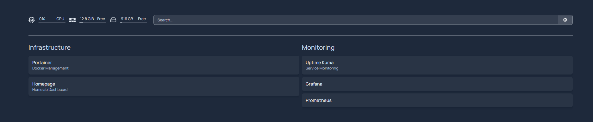
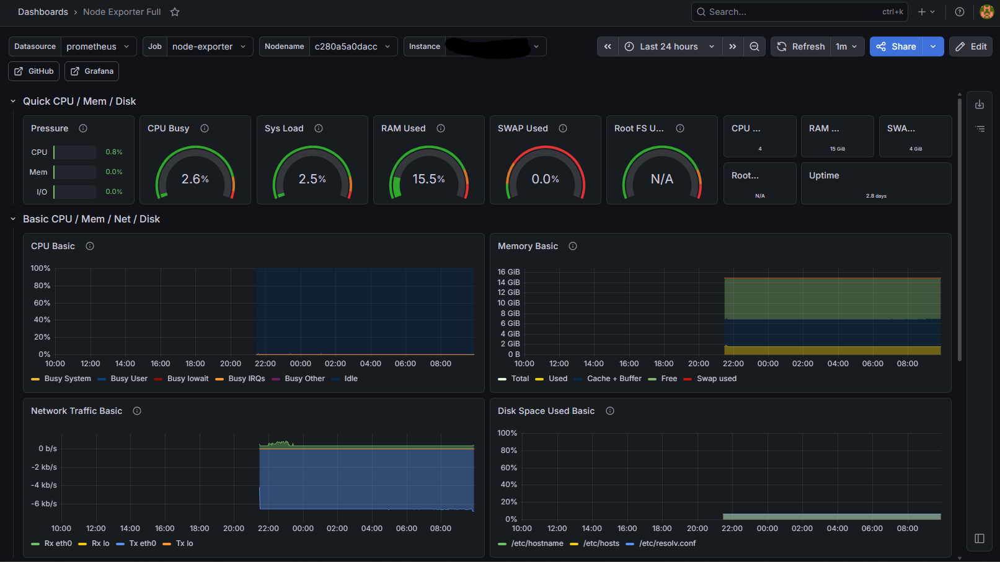
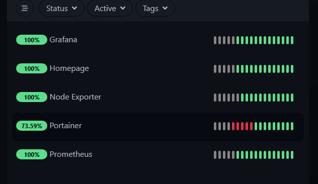

# Homelab Setup

This repository documents my Linux-based homelab and cybersecurity learning environment hosted on Server02.

## Current Environment

- Ubuntu Linux Server
- SSH Remote Administration
- GitHub Version Control
- Bash Scripting

## Goals

- Improve Linux administration skills
- Learn networking and cybersecurity tools
- Practice Git and GitHub workflows
- Build practical infrastructure projects

## Planned Additions

- Docker containers
- Network traffic monitoring
- Pi-hole
- VPN services
- Security tooling

## Observability Stack Added

Implemented a containerized monitoring and observability stack on Server02 using Docker.

### Services Added
- Grafana
- Prometheus
- Node Exporter
- Uptime Kuma
- Homepage Dashboard
- Portainer

### Features Configured
- Linux system metrics monitoring
- Service uptime monitoring
- Dashboard visualization
- Metrics collection pipeline
- Docker containerized deployment

### Monitoring Pipeline
Node Exporter → Prometheus → Grafana

### Uptime Monitoring
Uptime Kuma monitors:
- Grafana
- Prometheus
- Homepage
- Portainer
- Node Exporter

## Screenshots

### Homepage Dashboard

### Grafana Monitoring

### Uptime Kuma

