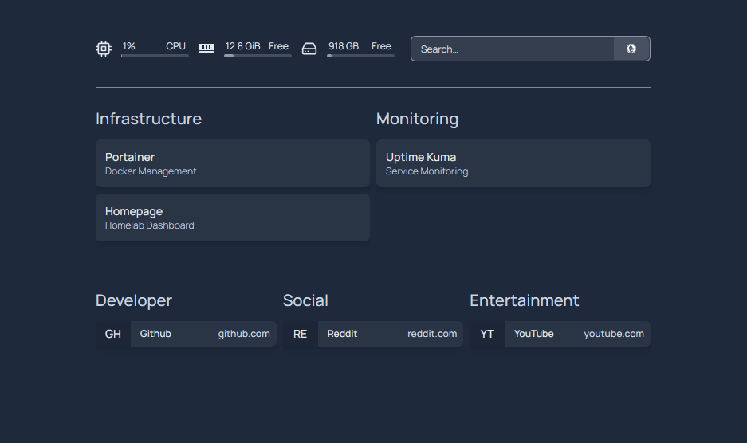

# Dashboard and Monitoring Setup

## Homepage Dashboard

The Homepage dashboard provides centralized access to homelab infrastructure and monitoring services.

### Features
- Centralized service access
- Docker-integrated homepage
- Persistent configuration storage

## Uptime Kuma
Deployed Uptime Kuma for service monitoring and uptime tracking.

### Monitoring Goals
- Monitor internal homelab services
- Track uptime and outages
- Verify service availability

## Skills Practiced
- Docker stacks
- Portainer management
- YAML configuration
- Service monitoring
- Web service deployment
- Homelab organization
